<div align="center">

# ⚡ Streamly

### Adaptive HLS streaming, a TikTok-style Shorts feed, and offline downloads, in a 100% Jetpack Compose app

**Clone it, build it, press Play. No backend, API keys or setup needed.**

[](https://kotlinlang.org)
[](https://developer.android.com/jetpack/compose)
[](https://developer.android.com/media/media3)
[](https://ktor.io)
[](https://dagger.dev/hilt)
[](https://developer.android.com/guide/navigation/navigation-3)
[](#-architecture)
[-3DDC84?logo=android&logoColor=white)](#-prerequisites)

</div>

---

> **TL;DR:** Streamly is a full video app built the way production Android apps are built: Clean Architecture, unidirectional data flow, a single lifecycle-aware ExoPlayer, a two-player pool for Shorts, real offline HLS downloads through Media3's `DownloadManager`, and edge-to-edge layouts that stay out from under the system bars in portrait **and** landscape.

---

## 📸 Screenshots

<table>
  <tr>
    <td align="center">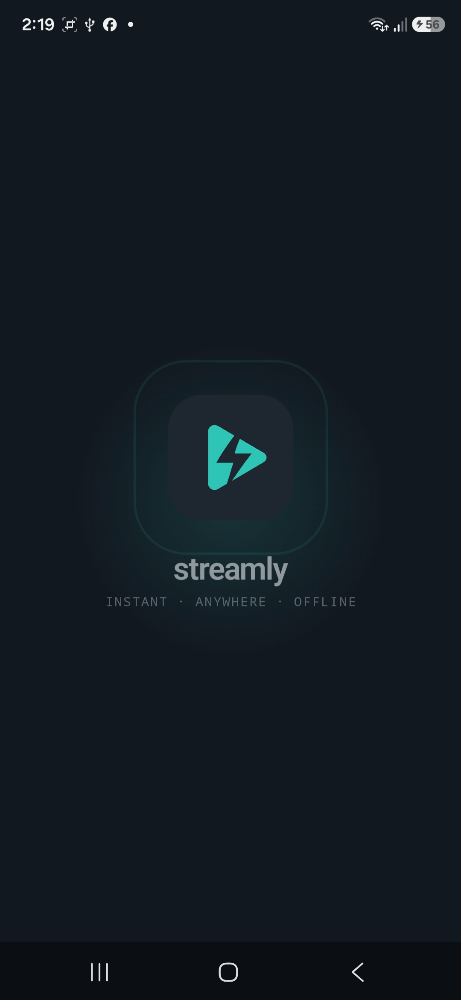<br/><sub><b>Splash</b><br/>Vector logo animation</sub></td>
    <td align="center">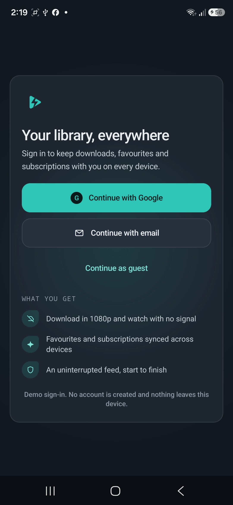<br/><sub><b>Onboarding</b><br/>Google / Email / Guest</sub></td>
    <td align="center">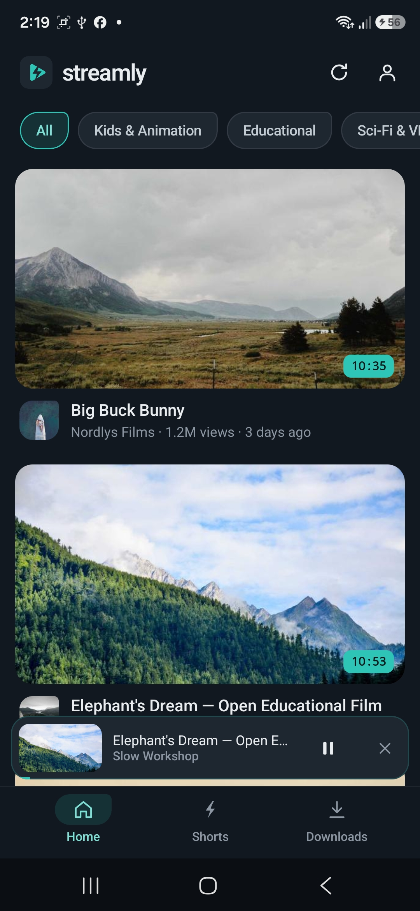<br/><sub><b>Home</b><br/>Feed + docked mini-player</sub></td>
    <td align="center">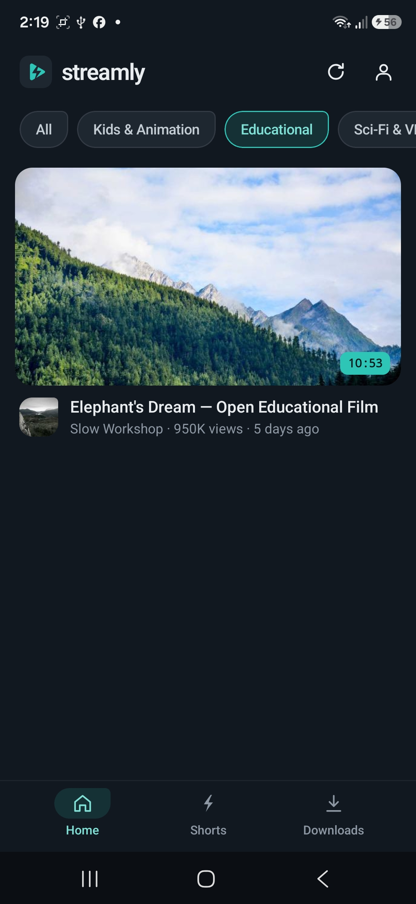<br/><sub><b>Category filter</b><br/>Chips filter the feed</sub></td>
  </tr>
  <tr>
    <td align="center">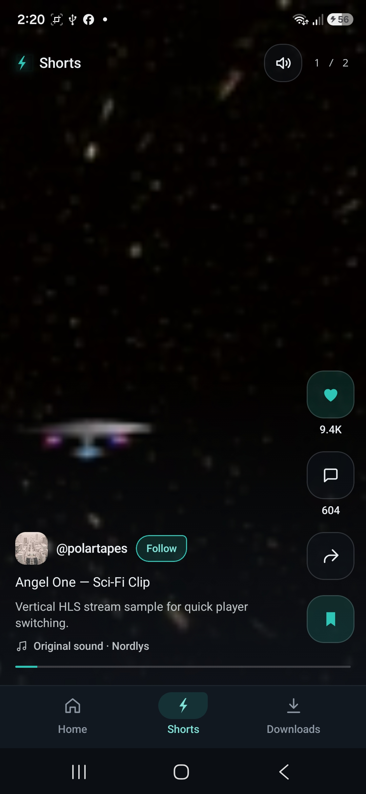<br/><sub><b>Shorts</b><br/>Liked + saved, mute toggle</sub></td>
    <td align="center">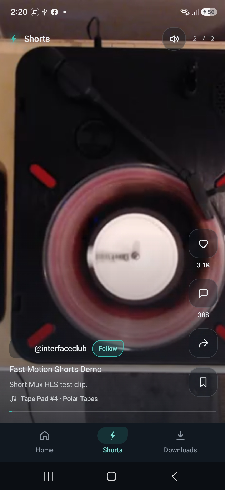<br/><sub><b>Shorts feed</b><br/>Swipe between HLS clips</sub></td>
    <td align="center">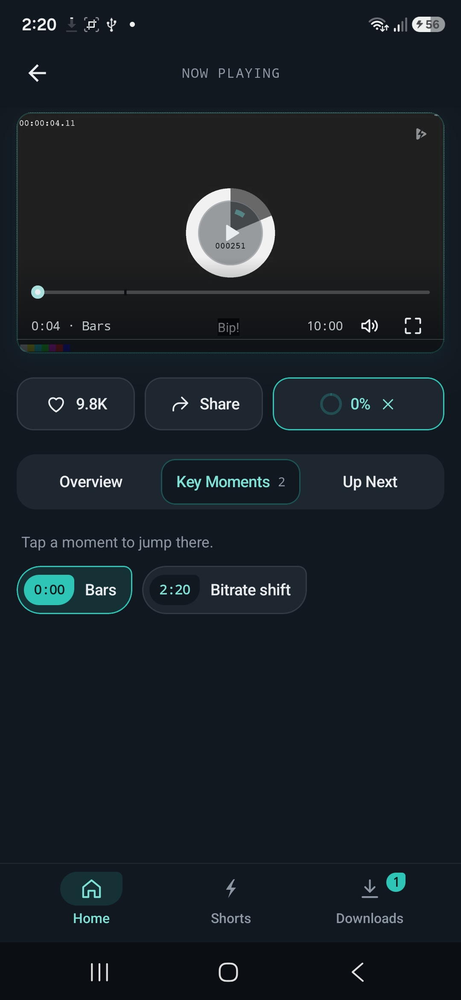<br/><sub><b>Player</b><br/>Key Moments + live download</sub></td>
    <td align="center">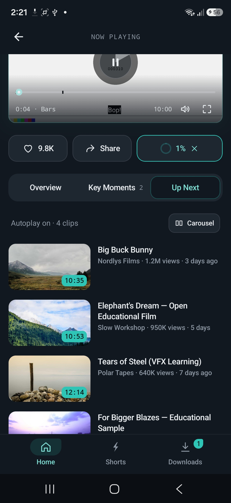<br/><sub><b>Up Next</b><br/>List / carousel layouts</sub></td>
  </tr>
  <tr>
    <td align="center">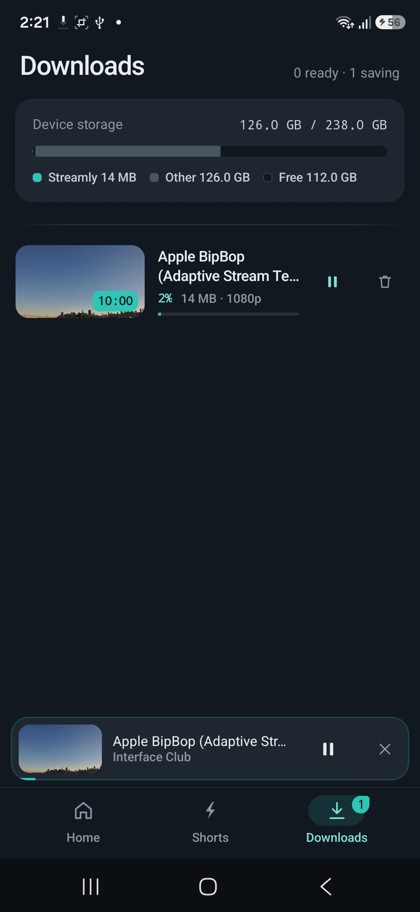<br/><sub><b>Downloads</b><br/>Progress, pause, storage card</sub></td>
    <td align="center">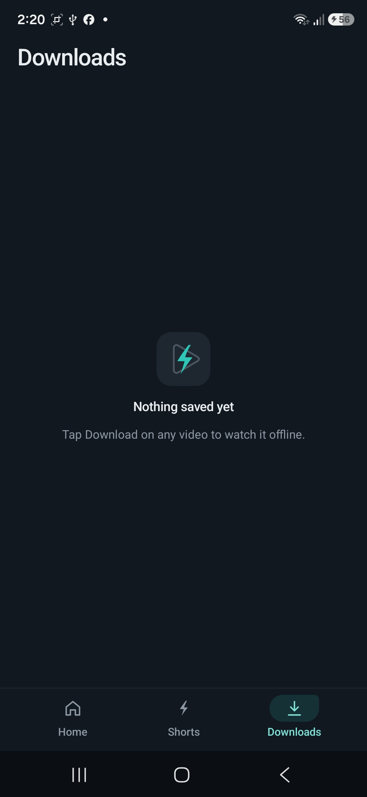<br/><sub><b>Empty state</b><br/>Explicit Empty UI state</sub></td>
    <td align="center">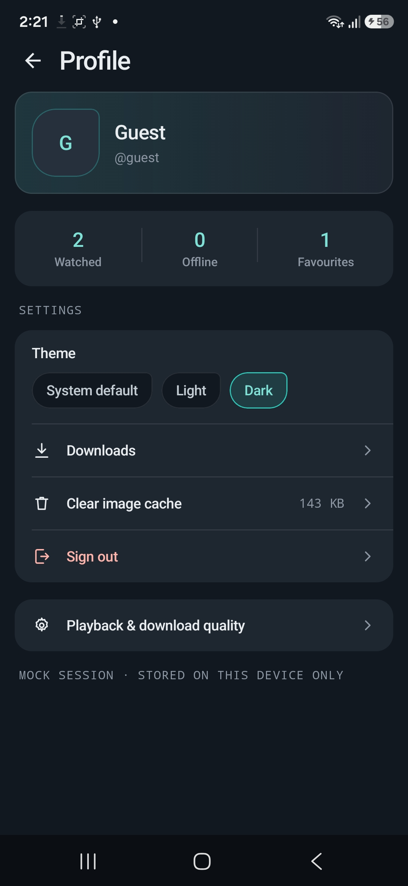<br/><sub><b>Profile</b><br/>Stats, theme, cache</sub></td>
    <td align="center">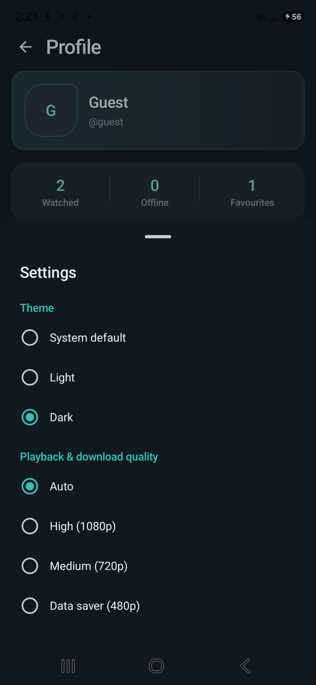<br/><sub><b>Settings</b><br/>Theme + quality cap</sub></td>
  </tr>
  <tr>
    <td align="center">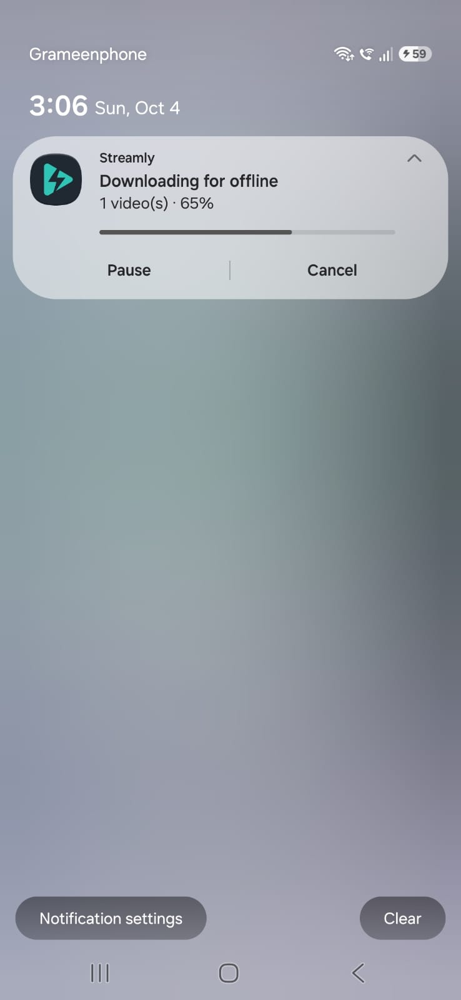<br/><sub><b>Download notification</b><br/>Live progress, Pause / Cancel</sub></td>
  </tr>
</table>

<sub>Captured on a Samsung Galaxy A36 (Android 16), Dark theme.</sub>

---

## 📑 Table of Contents

- [Screenshots](#-screenshots)
- [What is Streamly?](#-what-is-streamly)
- [Features](#-features)
- [Quick Start](#-quick-start-5-minutes)
- [Prerequisites](#-prerequisites)
- [Build, Run & Test](#-build-run--test)
- [Why it works with zero setup](#-why-it-works-with-zero-setup)
- [Tech Stack](#-tech-stack)
- [Architecture](#-architecture)
- [Project Structure](#-project-structure)
- [How the Video Playback Works](#-how-the-video-playback-works)
- [AI-Assisted Development Workflow](#-ai-assisted-development-workflow)
- [Trade-offs & Shortcuts (and Why)](#-trade-offs--shortcuts-and-why)
- [Known Limitations & Roadmap](#-known-limitations--roadmap)
- [Glossary for Beginners](#-glossary-for-beginners)
- [Further Reading](#-further-reading)

---

## 🎬 What is Streamly?

Streamly is an Android video-streaming app, something like a compact YouTube + Shorts. You can:

1. **Browse** a feed of videos on the Home screen and filter it by category.
2. **Watch** a video in a player with chapters ("Key Moments"), Up Next suggestions, fullscreen, mute and ±10s seek.
3. **Swipe** through a vertical, full-screen **Shorts** feed, like TikTok or Instagram Reels.
4. **Download** videos and watch them later **with no internet connection**.
5. Keep watching in a **mini-player** while you browse other tabs.

Every screen is written in **Jetpack Compose** (no XML layouts) and follows a custom design called **Nordic Mint**: a dark slate background with a mint accent.

---

## ✨ Features

### 🎥 Streaming & Playback
| Feature | Details |
|---|---|
| **HLS adaptive streaming** | `.m3u8` streams through Media3's HLS module. ExoPlayer moves between quality levels as network speed changes. |
| **Progressive MP4** | Plain `.mp4` files play through the same player. |
| **Custom player overlay** | Compose controls drawn over the video: play/pause, **±10s seek**, **mute/unmute**, a scrubber with chapter ticks, fullscreen. The controls hide automatically after 3 seconds. |
| **Key Moments** | Chapter list. Tap one to jump to it, and the scrubber label shows the current chapter. |
| **Quality cap** | Choose Auto / 1080p / 720p / 480p. ExoPlayer's track selection enforces it. |
| **Mini-player** | Playback continues when you leave the Player, with a docked bar on Home and Downloads. |

### 📱 Shorts Feed
| Feature | Details |
|---|---|
| **Vertical pager** | Full-screen swipe feed. Tap to pause, with a buffering spinner and a progress bar. |
| **Two-player pool** | The next short is **pre-loaded and paused on its first frame**, so swiping starts it instantly. There are never more than 2 players at once, so audio from one video can't play under another. |
| **Engagement rail** | Like, Save, Share (the system share sheet) and Follow, all saved on the device. |
| **Feed-wide mute** | Mute stays on as you swipe from short to short. |

### 💾 Offline & Persistence
| Feature | Details |
|---|---|
| **Real HLS downloads** | Media3 `DownloadManager` and a foreground service, with live progress, **pause/resume**, cancel, and notification actions. |
| **Offline playback** | Downloaded videos play from the on-disk cache with no network at all. |
| **Fallback content** | If the API can't be reached, the app shows a built-in catalogue of public test streams, so the screens are never empty. |
| **DataStore preferences** | Theme, quality, favourites, saves, follows, watch history and session all survive app restarts. |

### 🎨 UI / UX
| Feature | Details |
|---|---|
| **Edge-to-edge** | Draws behind the system bars and pads for `WindowInsets` on **every side**, so nothing clickable sits under the gesture bar, even in landscape. |
| **Adaptive layout** | A bottom bar on phones and a navigation rail on tablets, foldables and in landscape (driven by `WindowSizeClass`). On wide screens the Player shows the video and its details side by side. |
| **Orientation-aware fullscreen** | Rotating the phone enters fullscreen, and the fullscreen button locks landscape. Leaving fullscreen in any way (button, rotation, back) restores the orientation. |
| **Onboarding & Profile** | First-run onboarding (Guest / mock sign-in), a Profile screen with stats, theme switching and cache clearing. |
| **Animated splash** | The logo is drawn from vector paths at every frame, so it stays sharp while it animates. |
| **Accessibility** | Every control over the video has a label for TalkBack and a real touch target. |

---

## 🚀 Quick Start (5 minutes)

```bash
# 1. Clone the repository
git clone https://github.com/roytridiv/Streamly.git
cd Streamly

# 2. Build the debug APK
./gradlew assembleDebug          # Windows: gradlew.bat assembleDebug

# 3. Install it on a connected device or a running emulator
./gradlew installDebug           # Windows: gradlew.bat installDebug
```

Then open **Streamly** on the device, tap **Continue as Guest**, and press play. 🎉

> 💡 **Prefer Android Studio?** Choose **File → Open**, select the `Streamly` folder, wait for the Gradle sync to finish, pick a device in the toolbar, and click **▶ Run**.

---

## 🧰 Prerequisites

| Requirement | Version | Notes |
|---|---|---|
| **Android Studio** | Latest stable | The project uses **Android Gradle Plugin 9.0** and **Gradle 9.1** (the wrapper downloads Gradle automatically). Older Studio releases can't sync AGP 9. If you see an "unsupported AGP version" error, update Android Studio. |
| **JDK** | **17 or newer** | Android Studio ships its own JDK (JetBrains Runtime), which works. |
| **Android SDK** | Platform **36** | Android Studio offers to install it on the first sync. |
| **Device / emulator** | **Android 7.0+ (API 24+)** | A physical device is best for video. Use an emulator image **with Google APIs**. |
| **Internet** | Required for streaming | Not required for videos you have already downloaded. |

### Running Gradle from a terminal (outside Android Studio)

Gradle needs to find a JDK. If you see `JAVA_HOME is not set`, point it at Android Studio's bundled JDK:

```bash
# macOS
export JAVA_HOME="/Applications/Android Studio.app/Contents/jbr/Contents/Home"

# Linux
export JAVA_HOME="$HOME/android-studio/jbr"

# Windows (Git Bash)
export JAVA_HOME="/c/Program Files/Android/Android Studio/jbr"

# Windows (PowerShell)
$env:JAVA_HOME = "C:\Program Files\Android\Android Studio\jbr"
```

The Android SDK location comes from `local.properties` (`sdk.dir=...`). Android Studio creates this file on the first sync. If you build only from the command line, create it yourself or set `ANDROID_HOME`.

### Running on a physical device

1. On the phone, open **Settings → About phone** and tap **Build number** 7 times to unlock Developer options.
2. In **Settings → Developer options**, turn on **USB debugging**.
3. Connect by USB and accept the "Allow USB debugging?" prompt.
4. Check that the phone is detected: `adb devices` should list it as `device`.

---

## 🛠 Build, Run & Test

| Task | Command | What it does |
|---|---|---|
| Build debug APK | `./gradlew assembleDebug` | Writes `app/build/outputs/apk/debug/app-debug.apk` |
| Install on device | `./gradlew installDebug` | Builds and installs on the connected device |
| Unit tests | `./gradlew test` | Runs JVM unit tests (`app/src/test`) |
| Instrumented tests | `./gradlew connectedAndroidTest` | Runs on-device tests (`app/src/androidTest`). Needs a device. |
| Clean build | `./gradlew clean assembleDebug` | Rebuilds from scratch |

> ⚠️ **Honest note on tests:** the test source sets currently hold only the template tests. So far the project has been checked with full **manual test runs on physical devices** (moto e5 plus on Android 8.0 / API 26, Samsung Galaxy M01 on Android 10, and Samsung Galaxy A36 on Android 16), with logcat reviewed for errors. The moto and M01 runs are written up in [`AGENTS.md`](AGENTS.md). Unit tests for the ViewModels and repositories are first on the [roadmap](#-known-limitations--roadmap).

On Windows, use `gradlew.bat` instead of `./gradlew` in `cmd`/PowerShell. `./gradlew` works in Git Bash.

---

## 🔌 Why it works with zero setup

The app is designed to work against a real REST API. `BuildConfig.BASE_URL` points at it, and the Ktor client calls `GET videos`, `GET shorts` and `GET videos/{id}`. **No backend is deployed yet**, so `BASE_URL` is a placeholder (`https://api.example.com/`).

The repository handles that **without the UI ever knowing**:

```kotlin
// data/repository/VideoRepositoryImpl.kt (simplified)
private suspend fun fetchOrFallback(fallback: List<Video>, fetch: suspend () -> List<Video>) =
    Result.success(runCatchingCancellable { fetch() }.getOrElse { fallback })

/** Like runCatching, but rethrows CancellationException so coroutine cancellation still works. */
private suspend fun <T> runCatchingCancellable(block: suspend () -> T): Result<T> =
    try { Result.success(block()) }
    catch (e: CancellationException) { throw e }
    catch (e: Exception) { Result.failure(e) }
```

1. The app **tries the real API first**.
2. If that fails (no server, a timeout, a bad response), it **falls back to a curated catalogue** of public test streams (Google's Shaka demo assets, Apple's BipBop, Unified Streaming's Tears of Steel, Mux test streams, Internet Archive).
3. **`CancellationException` is always rethrown.** A plain `runCatching` would swallow it, so a screen the user has already left would carry on and show fallback data. Rethrowing keeps cancellation working.
4. Videos you have **downloaded** still open when the API is down: the Player falls back to the metadata stored with the download.

**Result:** reviewers can clone, build and press Play with no server, no API keys and no `.env` file. To use a real backend, change one line in `app/build.gradle.kts`:

```kotlin
buildConfigField("String", "BASE_URL", "\"https://your-api.example.com/\"")
```

---

## 🧪 Tech Stack

| Area | Library | Why |
|---|---|---|
| Language | **Kotlin 2.0**, Coroutines, Flow | Structured concurrency, cold and hot streams |
| UI | **Jetpack Compose** + Material 3 | Declarative UI, no XML |
| Adaptive UI | `material3-window-size-class` | Phone / tablet / foldable layouts |
| Navigation | **Navigation 3** | The back stack is a plain list the app owns, and each screen gets its own ViewModel |
| Video | **Media3 ExoPlayer** + `exoplayer-hls` + `media3-ui` | Industry-standard playback with adaptive HLS |
| Downloads | Media3 `DownloadManager` + `DownloadService` | Real offline HLS with a foreground service |
| Networking | **Ktor** client (CIO) + kotlinx.serialization | Kotlin-first, coroutine-native HTTP |
| DI | **Hilt** (KSP) | Compile-time dependency graph; assisted injection for the Player |
| Persistence | **Preferences DataStore** | Async, transactional key-value storage |
| Images | **Coil** | Compose-native image loading with caching |
| Splash | `core-splashscreen` | Android 12+ splash API, backported |

---

## 🏛 Architecture

Streamly uses **Clean Architecture** with **MVVM + MVI**. Data flows **one way** (Unidirectional Data Flow).

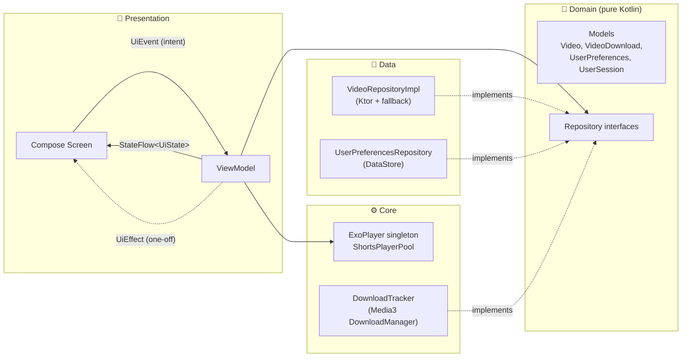

### The layers

| Layer | What lives here | Depends on | Never depends on |
|---|---|---|---|
| **`domain`** | Models and repository **interfaces** | Kotlin stdlib + coroutines only | Android, Ktor, Media3, DataStore |
| **`data`** | Repository implementations, Ktor DTOs and mappers, DataStore | `domain` | `presentation` |
| **`core`** | Infrastructure: Hilt modules, Ktor client, players, download manager, theme | `domain` | `presentation` |
| **`presentation`** | Compose screens, ViewModels, the Navigation 3 graph | `domain`, `core` (players, theme) | `data` |

> 📝 **Note:** these layers are **packages inside one `:app` Gradle module**, not separate Gradle modules, and the dependency rules are kept by convention. There is also no separate use-case layer: ViewModels call the repository interfaces directly, because so far no business rule is shared between screens. Both choices are explained in [Trade-offs](#-trade-offs--shortcuts-and-why).

### How a screen works (MVI in practice)

Every screen has the same four parts:

```text
HomeUiState.kt   →  sealed: Loading | Success | Empty | Error(message)   ← exactly what the UI draws
HomeUiEvent.kt   →  sealed intents: OnVideoClick, OnCategorySelect, Refresh …
HomeViewModel.kt →  exposes ONE StateFlow<HomeUiState>, handles events in onEvent(event)
HomeScreen.kt    →  HomeRoute (wires the ViewModel)  +  HomeScreen (stateless, previewable)
```

- **Explicit states.** Every screen draws `Loading`, `Success`, `Empty` and `Error`, and each error state has a **Retry** button.
- **One-off effects** such as navigation, toasts and share sheets go through a `Channel`, so **rotating the screen never replays them**.
- **Stateless composables** take state and callbacks, so they can be previewed and tested without a ViewModel.

### Media3 is kept out of the UI layer

- **One shared `ExoPlayer`** for the standard player, created by Hilt as an `@Singleton`. Screens never rebuild or release it. It **survives rotation and navigation** without re-buffering, which is what makes the mini-player handover seamless.
- The **UI only gets a `Player` interface** to attach a surface to. It cannot rebuild or release the player.
- A **process-lifecycle observer** pauses playback when the app goes to the background.
- **Shorts use a separate pool of two players** (`ShortsPlayerPool`). It belongs to the Shorts ViewModel and is released when Shorts leaves the back stack.
- **`NowPlayingStore`** mirrors the shared player's state for the mini-player, so Home and Downloads can show what's playing without owning a player.

### Edge-to-edge in every orientation

In landscape the system navigation bar and any display cutout move to the **side** of the screen. `statusBarsPadding()` / `navigationBarsPadding()` only pad the top or bottom edge, so they miss that. Streamly uses three small helpers (`presentation/common/SafeInsets.kt`) built on `WindowInsets.safeDrawing` / `safeContent`, which pad whichever edge actually holds a system bar:

- The **navigation rail** pads only its leading edge and the vertical edges, so it isn't oversized in landscape.
- The **fullscreen player** uses `safeContent`, which includes the *gesture* areas. When the bars are hidden, the home indicator and back-gesture edges still take touches, and this keeps the scrubber and buttons clear of them.
- The content area **consumes** the insets the visible navigation bar already covers, so screens don't pad for them twice.

---

## 🗂 Project Structure

```text
app/src/main/java/com/tridivroy/streamly/
├── core/
│   ├── di/            # Hilt modules: MediaModule (ExoPlayer), DownloadModule, DataStore, repositories
│   ├── media/         # ShortsPlayerPool, NowPlayingStore, DownloadTracker, MediaDownloadService
│   ├── network/       # Ktor HttpClient (timeouts, JSON, logging, base URL)
│   ├── storage/       # Device storage stats, image-cache cleaner
│   └── theme/         # Nordic Mint colours, typography, shapes, vector icons, logo
├── domain/
│   ├── model/         # Video, Channel, Chapter, VideoDownload, UserPreferences, UserSession
│   └── repository/    # VideoRepository, DownloadRepository, PreferencesRepository (interfaces)
├── data/
│   ├── remote/dto/    # VideoDto (kotlinx.serialization)
│   ├── mapper/        # DTO → domain mapping
│   ├── local/datastore/  # UserPreferencesRepository (DataStore)
│   └── repository/    # VideoRepositoryImpl (API + fallback catalogue)
└── presentation/
    ├── navigation/    # Nav3 graph, keys, bottom bar, rail, mini-player
    ├── splash/  onboarding/  home/  shorts/  player/  downloads/  profile/  settings/
    ├── common/        # Shared helpers: insets, formatting, playback progress
    └── components/    # Shared UI: toast host, etc.
```

---

## 🎞 How the Video Playback Works

<details>
<summary><b>▶ Standard Player: from tap to first frame</b></summary>

1. Home emits `NavigateToPlayer(videoId)`. Navigation 3 pushes `PlayerKey(videoId)`.
2. `PlayerViewModel` is created through **Hilt assisted injection**, with the `videoId` passed in.
3. It loads the video (API → fallback → downloaded copy), applies the **quality cap** to ExoPlayer's track selector, and calls `setMediaItem` + `prepare()` on the shared player.
4. `toMediaItem()` marks `.m3u8` URLs as `APPLICATION_M3U8`, so HLS is detected even when the URL has query parameters or no file extension.
5. The media source factory reads **through the download cache first**, so downloaded videos play offline from any screen without extra code.
</details>

<details>
<summary><b>📱 Shorts: why swipes start instantly</b></summary>

- Page `i` always plays on player `i % 2`.
- When a swipe **settles**, the active page plays and its neighbour is **prepared and paused on its first frame**.
- The next swipe therefore starts a player that is already buffered. There is no reload, and audio from one short never plays under another.
- Playback only switches once a swipe has finished, so dragging back and forth never makes the players thrash.
</details>

<details>
<summary><b>💾 Downloads: how offline HLS works</b></summary>

- `DownloadHelper` picks **one** HLS quality level (respecting your quality setting) instead of downloading every level.
- Each download stores its video **metadata**, so the Downloads screen and the Player still work with no network.
- The cache is a non-evicting `SimpleCache`: downloaded videos are never deleted automatically to free space.
- **Pause** uses a custom *stop reason*, so a download the user paused looks different from one that is just waiting its turn.
- Progress is **polled** while downloads run, because `DownloadManager` has no progress callback.
</details>

---

## 🤖 AI-Assisted Development Workflow

Streamly was built **agentically**: AI coding assistants wrote most of the code, and a human engineer set direction, reviewed every change, and tested on real devices.

### The tools

- **Claude Code (CLI)** was the main pair-programmer, working directly in the repository: reading code, making edits, running Gradle builds, and driving physical devices over ADB.
- **Gemini** was also used as a copilot.

### What the AI was used for

| Area | Examples from this project |
|---|---|
| **Architecture & state edge cases** | The `runCatchingCancellable` pattern (rethrowing `CancellationException` so leaving a screen still cancels its requests), the API → fallback → downloaded-copy chain, the two-player Shorts pool, a custom stop reason to tell paused downloads apart. |
| **UI/UX polish** | Edge-to-edge insets in landscape (navigation rail sizing, a fullscreen overlay clear of the gesture strip), crisp splash animation, accessible touch targets for controls over the video. |
| **Maintainable code** | Comments that record *why* a decision was made, not just what the code does. Explicit UI states. One-off effects that never replay. |
| **Debugging on real devices** | ADB smoke tests with logcat review and screenshots, which found bugs such as an unreachable dark theme on API 26, see-through overlays, and controls TalkBack couldn't activate. |

### Human oversight: the part that matters

- **Prompt engineering & scoping.** Each feature started as a written specification with clear acceptance criteria.
- **Verifying edge cases.** Every change ended with a build, and most with a test run on a physical device: rotation, app restarts, offline mode, landscape insets.
- **Test stream curation.** The fallback streams were picked by hand and checked to be publicly reachable and cover HLS, fMP4 HLS and progressive MP4.
- **Code review.** AI suggestions were questioned, not just accepted. Where the AI's first approach failed on a device (for example a notification "pause" action that never actually paused), the reason was found and documented, and the approach replaced.

### A transparent paper trail

| File | What it records |
|---|---|
| [`AGENTS.md`](AGENTS.md) | The architecture rules every agent follows, plus a **numbered log of each workflow**: what was asked, which files changed, how it was verified, and the commit. |
| [`docs/prompt-history.md`](docs/prompt-history.md) | **Every prompt, word for word, with a timestamp**, captured automatically by a Claude Code `UserPromptSubmit` hook (`.claude/hooks/log-prompt.sh`). |
| [`docs/project-overview-guide.md`](docs/project-overview-guide.md) | An in-depth architecture guide with a technical Q&A. |

---

## ⚖️ Trade-offs & Shortcuts (and Why)

| Decision | Why | What it would take to change |
|---|---|---|
| **Built-in public test streams instead of a custom backend** | A demo or interview build must play **every time**, with no server to host, pay for or keep running. Public HLS test streams from Google (Shaka), Apple, Unified Streaming, Mux and the Internet Archive are what media engineers use for this. | Set `BASE_URL` to a real API. The fallback stays as a safety net. |
| **Deterministic Picsum thumbnails** (`picsum.photos/seed/<seed>`) | Real-looking, **stable** artwork without bundling image assets into the APK. The same seed always returns the same image. | The thumbnail URLs come from the API instead. |
| **No Room database** | The app persists only what it needs: **DataStore** for preferences, likes, follows, history and the session, and **Media3's own download index** (plus the on-disk cache) for offline videos. Feed lists are fetched again rather than stored, which keeps the data layer small. | Add a Room-backed `VideoRepository` decorator for offline feeds. The repository interfaces already isolate this, so ViewModels don't change. |
| **Single `:app` module** | Faster to iterate on. Layer boundaries are packages kept by convention. | Split into `:domain` / `:data` / `:core` / `:feature-*` Gradle modules so the compiler enforces the boundaries. |
| **No use-case layer** | ViewModels call the repository interfaces directly. Use cases that only pass calls through add files without adding behaviour. | Introduce use cases as soon as a business rule is shared between screens. |
| **Mock sign-in** | No identity provider yet. Google / Email create a clearly labelled **MOCK SESSION**, and Guest is a real session with no identity. | Plug in a real auth SDK behind `PreferencesRepository.signIn`. |

---

## 🧭 Known Limitations & Roadmap

- [ ] **Unit tests** for ViewModels (Turbine + fake repositories) and `VideoRepositoryImpl`'s fallback logic.
- [ ] **Replace a dead fallback link:** Google's `ForBiggerBlazes.mp4` sample now returns `403 Forbidden`.
- [ ] Resuming a paused download from the **notification**. Pausing ends Media3's foreground service, so for now resume from the Downloads screen.
- [ ] Real backend + authentication.
- [ ] Split into Gradle modules. Add a Room cache for feeds.
- [ ] Picture-in-Picture and a `MediaSession` for lock-screen controls.

---

## 📖 Glossary for Beginners

| Term | Plain-English meaning |
|---|---|
| **HLS (`.m3u8`)** | *HTTP Live Streaming.* The video is split into small chunks at several quality levels, and the player picks the best one your connection can handle, chunk by chunk. |
| **Adaptive bitrate** | That automatic switching between quality levels as your network speeds up or slows down. |
| **ExoPlayer / Media3** | Google's video player library for Android. Media3 is the current home of ExoPlayer. |
| **Jetpack Compose** | Android's modern UI toolkit. You describe the UI in Kotlin functions and it redraws when the state changes. |
| **Clean Architecture** | Splitting code into layers (UI → business rules → data) so each one can change without breaking the others. |
| **MVVM / MVI** | The UI sends *events* to a ViewModel, which publishes one *state*, and the UI draws that state. |
| **Unidirectional Data Flow** | Data goes one way: events up, state down. That makes bugs easier to track down. |
| **Hilt** | Creates objects (the player, the HTTP client, repositories) and hands them to whatever needs them, so classes don't build their own dependencies. |
| **Ktor** | A Kotlin HTTP client used to call the REST API. |
| **DataStore** | A small, safe key-value store for settings and preferences. |
| **Edge-to-edge / insets** | The app draws behind the status and navigation bars. *Insets* say how much space those bars take, so buttons can stay out from under them. |

---

## 📚 Further Reading

- 🏛 **[Project Overview & Architecture Guide](docs/project-overview-guide.md):** architecture in depth, with a technical Q&A (why a singleton player, how offline HLS works, how insets are handled, and more).
- 🤖 **[AGENTS.md](AGENTS.md):** the agent rules and the full log of each workflow.
- 📝 **[Prompt History](docs/prompt-history.md):** every prompt that built this app, word for word.

<div align="center">

---

Built with ☕, Kotlin, and a lot of real-device testing by **[Tridiv Roy](https://github.com/roytridiv)**

⭐ If you found this useful, consider starring the repo!

</div>
